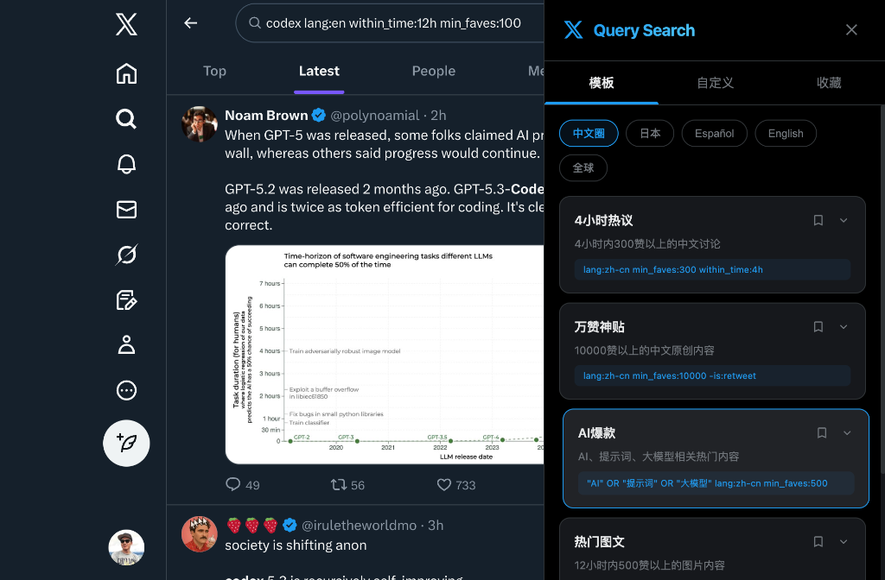

# X Query Search 🚀 (中文版)

高级 X.com 搜索查询构建器和管理器。此 Chrome 扩展程序通过强大的搜索模板和自定义查询构建器，帮助您在 X.com 上发现高质量内容。

## 📥 快速安装 (推荐)

如果您不想从源码构建，可以直接使用我们提供的预构建版本：

1. **下载项目**: 点击本仓库右上角的 `Code` -> `Download ZIP` 并解压，或者克隆仓库。
2. **在 Chrome 中加载**:
   - 打开 Chrome 浏览器，访问 `chrome://extensions`。
   - 开启右上角的 **开发者模式**。
   - 点击 **加载已解压的扩展程序 (Load unpacked)**。
   - 选择本仓库中的 **`dist`** 文件夹。
3. **完成**: 此时扩展图标应出现在工具栏中，访问 [x.com](https://x.com) 即可使用！

---

## 功能特点

- **🔍 搜索模板**: 针对不同地区（中文、英文、日文等）和话题的预设搜索模式。
- **🛠️ 自定义查询构建器**: 使用关键词、语言、时间范围和最小点赞数轻松构建复杂查询。
- **⚡ 高级设置**: 可选过滤媒体类型（图片/视频）和排除项（转推、回复、链接）。
- **🔖 收藏夹管理器**: 保存您常用的搜索查询，点击即可快速触发。
- **🔗 深度 X 集成**: 直接跳转到 X.com 的实时搜索结果页面。
- **💻 优质设计**: 采用简洁、原生的 Twitter/X 风格美学设计。

## 🛠️ 开发者指南 (从源码构建)

如果您想修改代码或自行构建：

1. **环境准备**: 确保已安装 Node.js 和 `pnpm`。
2. **安装依赖**: `pnpm install`
3. **构建项目**: `pnpm build`
4. **开发模式**: `pnpm dev` (支持热重载)

## 许可证

MIT

---

# X Query Search 🚀 (English)

Advanced X.com search query builder and manager. This Chrome extension helps you find high-quality content on X.com using powerful search templates and a custom query builder.

## 📥 Quick Start (Recommended)

If you don't want to build from source, you can use the pre-built version directly:

1. **Download the project**: Click `Code` -> `Download ZIP` and extract it, or clone the repository.
2. **Load in Chrome**:
   - Open Chrome and go to `chrome://extensions`.
   - Enable **Developer mode** in the top right.
   - Click **Load unpacked**.
   - Select the **`dist`** folder in this repository.
3. **Done**: The extension is now active. Refresh [x.com](https://x.com) to start searching!

---

## Features

- **🔍 Search Templates**: Predefined search patterns for different regions and topics.
- **🛠️ Custom Query Builder**: Build complex queries using keywords, languages, and time ranges.
- **⚡ Advanced Filters**: Toggle filters for media types and exclusions.
- **🔖 Favorites Manager**: Save and trigger frequently used search queries.
- **🔗 Deep X Integration**: Navigates directly to live search results on X.com.

## 🛠️ Developer Guide (Build from Source)

1. **Prerequisites**: Ensure you have Node.js and `pnpm` installed.
2. **Install**: `pnpm install`
3. **Build**: `pnpm build`
4. **Development**: `pnpm dev`

## License

MIT
